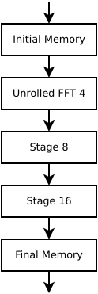
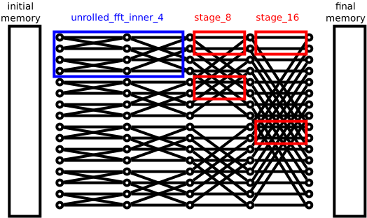

# High Throughput FFT Implementation

An implementation designed to work for large FFT sizes, high clock frequencies,
and with multiple samples consumed every clock cycle.

Currently only supports fixed-point arithmetic but shouldn't be difficult to extend
to floating point.

Several of the VHDL entities, including the top-level entity are generated.  The
parameters for the top-level generator are:

- **N**: The number of samples in a FFT.  Must be a power of two.
- **SPCC**: The number of samples consumed every clock cycle.  Must be at least 2 and a power of two.
- **INPUT_WIDTH**: The bit-width of an input sample.
- **SUFFIX**: A suffix appended to the generated entity names.

Generation is done using Jinja2 templates and Fusesoc generators.  Testing is done using cocotb.
An fully unrolled FFT for when N=SPCC was created as part of the HTFFT, but can also be
used independently.

Resource Usage and Timing
-------------------------

### N=1024, SPCC=4, WIDTH=32

Using Xilinx xczu5eg-fbvb900-2-i with `-mode out_of_context` for synthesis.

|       |                                  |
|-------|----------------------------------|
| LUT   |  7085 (of which 1812 are LUTRAM) |
| FF    |  6533                            |
| BRAM  |     9.5                          |
| DSP   |    80                            |

Comfortably meeting timing at 500 MHz.

For N=1024 we need 10 stages.  Each stage should have 2 butterflys which is 8 multiplications
so we're using 1 DSP/multiplication which makes sense.  For this chip we're using 6-7% of the
LUT, BRAM and DSP so it's a fairly balanced solution.

### N=4096, SPCC=16, WIDTH=32

Using Xilinx xczu5eg-fbvb900-2-i with `-mode out_of_context` for synthesis.

|       |                                   |
|-------|-----------------------------------|
| LUT   |  26904 (of which 5095 are LUTRAM) |
| FF    |  46443                            |
| BRAM  |     57                            |
| DSP   |    384                            | 

Meeting timing at 500 MHz

For N=4096 we need 12 stages. Each stage should have 8 butterflys
which is 32 multiplications. We're using more than 1
dsp/multiplication. The bit-width going into the multiplications in
final stage will be 16 + 11 = 27 bits. The output will be 54 bits.
It's possible we need multiple DSPs to do these final multiplications.
We're using 64 extra dsps which implies the last 2 stages need 2 DSPs
for each multiplication.

To avoid this the core should really have an option to trim the MSB or LSB off at a certain stage.

For this configuration we have

    L=4096/32=128
    butterfly latency = 7
    stage_latency = butterfly_latency + L/2 + 2
    unrolled_latency = n_stages * butterfly_latency
                     = 5 * 7 = 35

    stage_32 = 7 + 2 + 32/32
    stage_64 = 7 + 2 + 64/32
    stage_32 + ... + stage_2048 = 9 * 8 + 1+2+4+8+16+32+64
                                = 72 + 127
                                = 199
    initial_memory = 128
    final_memory = 64
    
    total_latency = 199 + 128 + 64 = 391cc
    throughput = 1 fft/128 cc

At any given time the hardware is processing 4 different ffts at different
positions in the pipeline.

    Total throughput = 32 samples/cc
                     = 16 samples/ns  @ 500 MHz
                     = 16 GSamples/s
                     = 64 GB/s        @ 32bits per sample
                     OR
                     = 8 GHz of spectrum @ the Nyquist rate

Architecture
------------

The architecture of the HTFFT is split into four main components:
 - **Initial Memory** takes care of reordering the input vector.
 - **Unrolled FFT** performs SPCC-input FFTs on the input vectors.
   Because SPCC samples arrive every clock cycle, this module does
   not need any memory beyond the flipflops requried for pipelining.
 - **FFT Stages** are used for the subsequent stages of the FFT.
   These consume their inputs over multiple clock cycles and so require
   memories to store their inputs and peform reordering.
 - **Final Memory** takes care of reordering the output vector.
 
The diagram below shows a top level architecture for a 16-point FFT
that consumes 4 samples every clock cycle.

The following diagram shows how those hardware blocks would operate
on the FFT structure.  It doesn't take into account pipelining at all
so isn't realistic.

Top-level HTFFT Ports
---------------------
- **clk**: Clock, rising edge active.
- **i_first**: Indicates that this is the first clock cycle of an input vector.
- **i_data**: INPUT_WIDTH*SPCC bit-wide input data.  Contains SPCC complex samples.
- **o_first**: Indicates that this is the first clock cycle of an output vector.
- **o_data**: OUTPUT_WIDTH*SPCC bit-widt output data. Contains SPCC complex samples.

The OUTPUT_WIDTH of a complex sample is the INPUT_WIDTH + logceil(N)*2.

For a complex sample with width=WIDTH, the upper WIDTH/2 bits are the
signed real component, and the lower WIDTH/2 bits are the signed
imaginary component. To keep things simple, if INPUT_WIDTH=8, then a
signed value of 0100 would map to 1.0 and a signed value of 1100 would
map to -1.0. The absolute value of all input samples is required to be
less than or equal to 1.0.

Modules
-------

- HFFT
  * A high throughput FFT implementation.
  * Work in progress.
  * Initial memory and final memory are unimplemented.
 
- unrolled fft
  * An unrolled FFT implementation for when N = SIZE.
  * Working but needs work to investigate rounding and optimum precision
    at different stages.  Probably still buggy.
   
- unrolled fft inner
  * An internal module of the unrolled_fft. Includes everything except
    for the initial reordering. Used in both the HTFFT and the
    unrolled_fft implementations.

- comb reordering
  * Combinatorial reordering to use with unrolled_fft_inner to make
    unrolled_fft.
   
- stage
  * A stage in a FFT where SIZE < N.  Used interally in the HTFFT.
  * Mostly working but poorly tested.  Has issues with rounding an precision.
  * More [Stage Docs](/docs/stage.md)
 
- butterfly
  * A FFT butterfly module.  Used by 'stage' and 'unrolled_fft_inner'.

- mult
  * A multiplier implementation.  Used in butterfly module.
 
- memory
  * A basic memory implementation. Used in various places.
 
- shift register
  * A basic shift_register implementation. Used in various places.
 
- htfft pkg
  * A package with utility functions.
 
- initial memory
  * Does the initial reordering in the HTFFT.
  * Work in progress
  * More [Intial Memory Docs](/docs/initial_memory.md)
   
- barrel shifter
  * A barrel shifter implementation.  Used in the initial_memory. Unimplemented.

- final memory
  * Does the final reordering in the HTFFT.  Unimplemented.

Thinking about Rounding and Precision
-------------------------------------

- At the moment we extend the width of the complex numbers through the FFT.
  This is because there is the possibility for sharp peaks to occur if one
  frequency dominates.

- Alternatively if we thought there would be no sharp peaks we could 
  reduce the number of bits, and cap the output values from the butterflies
  to stay within the allowed range.

- For now, it makes sense to keep things simple and just use more bits.

- I think the bits in the twiddle factor should match the bits in the value that
  it is multiplying.  Am I doing this?
  
- Looking at the average error in the output from the FFT.

  | input_width |     16    |       32                          |
  |-------------|-----------|-----------------------------------|
  | N=1         | 0.0060    |   0.000023 no noise by definition |
  | N=4         |           |   0.000050 (bottom 1 bit noise)   |
  | N=8         | 0.023     |   0.000087 (bottom 1 bit noise)   |
  | N=16        |           |   0.00014  (bottom 2 bits noise)  |
  | N=32        |           |   0.00024  (bottom 3 bits noise)  |
  | N=64        |           |   0.00038  (bottom 4 bits noise)  |
  | N=128       |           |   0.00056  (bottom 4 bits noise)  |
  
  We can clearly remove some precision as we go through the stages, but it would take
  a bit of experimentation to work out how many bits it's safe to remove.
  
  I would have expected the error to scale as sqrt(N) but it's scaling a bit faster.
  
  Seems like nothing is horribly broken.  Next step would be to look at the literature
  a bit to see if there are any tricks I'm missing.

To do
-----
* [x] Butterfly
* [x] Unrolled FFT
* [x] FFT Stage
* [x] Initial memory
* [x] Final memory
* [x] Top level
* [x] Improve testing
* [x] Investigate rounding and precision
* [x] Check timing and resources
* [ ] Documentation
* [ ] Add testing with gaps between vectors
* [ ] Add option to trim bits from later stages
* [ ] Add support for floating point arithmetic
* [ ] Look at literature
