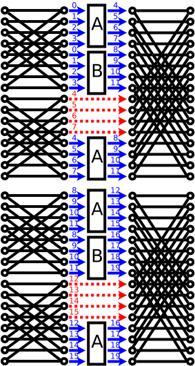

# Stage Documentation

Most of the complexity of the stage is dealing with the memory accesses.

The following diagram shows memory usage by a stage instance.

Each black line in the diagram represents SPCC/2 samples going through
SPCC/2 butterfly unit. The actual hardware for a FFT stage will
contain SPCC/2 butterfly units, so that it can meet the throughput
requirement of SPCC new samples per clock cycle.

Each blue line represents SPCC/2 samples begin written or read from a
memory.

Each red line represents a direct connection between the output from
one stages SPCC/2 butterfly units, into the input of the SPCC/2
butterfly units in the next stage.

The numbers above the arrows indicate on which clock cycle the data was
sent. The numbers on the left indicate when the data is produced by the
previous stage, whereas the numbers on the right indicate when the data
is required by the next stage.  The next stage starts four clock cycles
after the previous stage starts beacuse the is when the first inputs for
the next stage are available.

The six rectanges indicate memories that are required when the data
produced by the previous stage needs to be held until the next stage
is ready for it. By looking at the times at which the data is written
and then read, we can see that we can satisfy this required using two
different memories labelled A and B.

Memory A is always active and is always delaying the inputs by 4 clock
cycles. It could be implented with a shift register for small delays
like this, but for longer delays deep memories will be a better
choice.

Memory B is not always active, it delays inputs by 8 clock cycles but
at any given time only contains 4 sets of samples, and so can also
be implemented with a memory of depth 4.

More generally the required depth of memories A and B will be N/4 where
N is the size of the FFT for which this stage would be the last stage.

